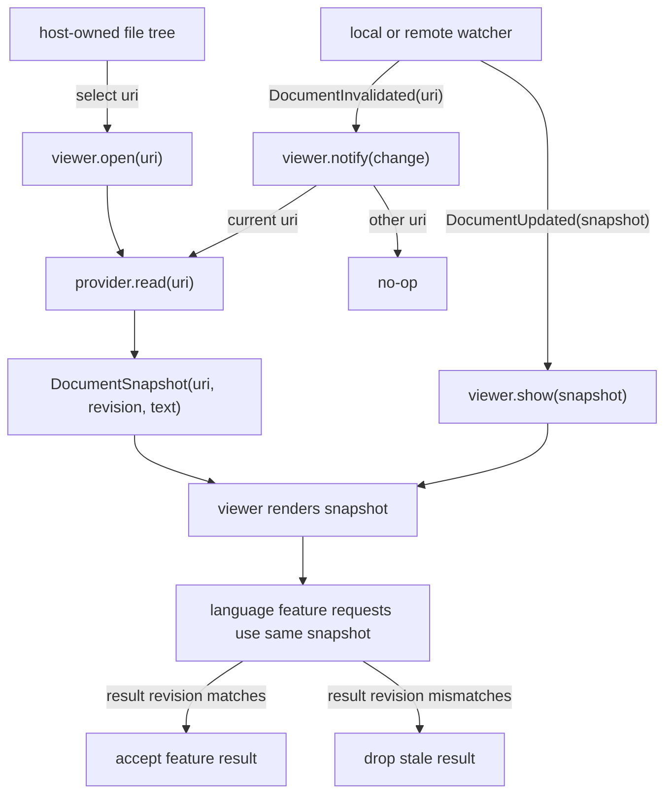

# Document Snapshot Viewer API

Status: proposed
Date: 2026-06-18

## Summary

Redesign the embeddable readonly viewer as one cohesive public API instead of a
set of ad hoc callbacks, source objects, and push methods. The API should be
Monaco-shaped where Monaco has a proven structure, but it should stay optimized
for this viewer's primary use case: showing externally owned files and
reflecting local or remote filesystem changes in real time.

The plan has four connected parts:

1. Add a shared lifecycle/event foundation in `base/common`: `Disposable`, and
   optionally `Event[T]` / emitter helpers if the implementation needs a named
   event type.
2. Expose viewer lifecycle and render notifications through typed `on_*`
   subscription methods such as `on_did_render_document`, each returning
   `Disposable`.
3. Replace the current `DocumentSource` / `SourceDocument` model with a
   document source API built around `DocumentProvider`, `DocumentChange`, and
   immutable `DocumentSnapshot`.
4. Make language features use Monaco-style `register_*_provider` APIs whose
   registrations return `Disposable` and whose providers receive
   `DocumentSnapshot`.

Compatibility with the current `DocumentSource`, `SourceDocument`, `push_*`,
and provider signatures is not a goal. The new public surface should optimize
for this product shape:

- the host owns the file tree and selects a URI;
- the viewer opens, watches, reloads, and renders document content for that URI;
- local or remote file changes arrive as document invalidations or updated
  snapshots;
- language features are computed against immutable snapshots and accepted only
  when their snapshot revision still matches the rendered document.

Monaco remains the naming and structural reference, but not the public model
contract. In Monaco, language providers receive `ITextModel`; in this viewer,
language providers should receive `workspace.DocumentSnapshot`.

Reference sources, used only as design references:

- `vscode/src/vs/monaco.d.ts`: `LanguageSelector`, `registerHoverProvider`,
  `registerDefinitionProvider`, `registerDocumentSemanticTokensProvider`,
  `ProviderResult`, and `editor.setModelMarkers`.
- `workspace/source.mbt`, `workspace/tree.mbt`, and `workspace/filesystem.mbt`:
  current `SourceDocument` / `DocumentSource` contracts to replace.
- `language/providers.mbt`: current provider traits that accept
  `@model.TextModel`.
- `renderer/browser/viewer.mbt`, `renderer/browser/registry.mbt`, and
  `renderer/browser/render.mbt`: current viewer open, watch, feature, and render
  flow.

## Whole API Shape

The public API should read as one lifecycle:

```moonbit
let viewer = Viewer::create(host, provider, services~)

let rendered = viewer.on_did_render_document(event => {
  // observe rendered uri/revision
})

let hovers = services.language_features.register_hover_provider(
  LanguageSelector::LanguageId("moonbit"),
  hover_provider,
)

viewer.open(uri)
viewer.notify(DocumentChange::DocumentInvalidated(uri~, known_revision=None))
viewer.reload()
viewer.close()

hovers.dispose()
rendered.dispose()
viewer.dispose()
```

`DocumentProvider` is the concrete public type name for the document source
contract. The plan uses "document source API" for the role, but does not keep
the old `DocumentSource` type name because that name belongs to the API being
replaced.

Package ownership should stay narrow:

- `base/common`: `Disposable`, optional `Event[T]`, and shared text primitives.
- `workspace`: `DocumentSnapshot`, `DocumentProvider`, `DocumentChange`, and
  document read errors.
- `language`: provider traits, selectors, cancellation tokens, diagnostics, and
  feature payload types.
- `renderer/browser`: `Viewer`, `ViewerServices`, `on_*` subscriptions,
  provider watching, DOM mounting, and render application.
- host/workbench/example code: file tree ownership, local or remote provider
  implementation, and explicit calls to `open`, `notify`, `reload`, or `show`.

## Target Mental Model

```text
Monaco:
  language provider receives ITextModel
  ITextModel is a live mutable buffer
  diagnostics are pushed as markers on a model

Viewer:
  language provider receives DocumentSnapshot
  DocumentSnapshot is immutable content for (uri, revision)
  diagnostics are pushed with (uri, revision, owner)
```

Flow:



## Target API Details

### Document Source API

Own these public concrete types in `workspace`, because embedders construct and
inspect them.

```moonbit
pub(all) struct DocumentSnapshot {
  uri : @base_common.Uri
  display_name : String
  language_id : String
  revision : String
  text : String
}

pub(all) enum DocumentReadResult {
  DocumentLoaded(DocumentSnapshot)
  DocumentNotFound(@base_common.Uri)
  DocumentReadFailed(DocumentError)
}

pub(all) enum DocumentChange {
  DocumentInvalidated(uri~ : @base_common.Uri, known_revision~ : String?)
  DocumentUpdated(DocumentSnapshot)
  DocumentDeleted(@base_common.Uri)
  DocumentChangeFailed(uri~ : @base_common.Uri, error~ : DocumentError)
}

pub(open) trait DocumentProvider {
  async fn read(Self, @base_common.Uri) -> DocumentReadResult
  fn watch(Self, @base_common.Uri, (DocumentChange) -> Unit) -> @base_common.Disposable
  fn close(Self, @base_common.Uri) -> Unit
}
```

`DocumentSnapshot` must also expose readonly text-model helpers so provider
authors do not need a Monaco-like mutable model:

```moonbit
pub fn DocumentSnapshot::line_count(self : DocumentSnapshot) -> Int
pub fn DocumentSnapshot::line_text(self : DocumentSnapshot, line : Int) -> String
pub fn DocumentSnapshot::line_start_offset(self : DocumentSnapshot, line : Int) -> Int
pub fn DocumentSnapshot::line_end_offset(self : DocumentSnapshot, line : Int) -> Int
pub fn DocumentSnapshot::position_at_offset(self : DocumentSnapshot, offset : Int) -> Position
pub fn DocumentSnapshot::offset_at_position(self : DocumentSnapshot, position : Position) -> Int
pub fn DocumentSnapshot::slice(self : DocumentSnapshot, range : Range) -> String
```

The viewer facade should be resource-command based:

```moonbit
pub fn Viewer::create(
  host : @rdom.Element,
  provider : &@workspace.DocumentProvider,
  services? : ViewerServices = ViewerServices::new(),
  options? : ViewerOptions = ViewerOptions::default(),
) -> Viewer

pub fn Viewer::open(
  self : Viewer,
  uri : @base_common.Uri,
  view_state? : ViewStatePolicy = RestoreOrReset,
) -> Unit

pub fn Viewer::reload(
  self : Viewer,
  view_state? : ViewStatePolicy = PreserveAnchor,
) -> Unit

pub fn Viewer::notify(
  self : Viewer,
  change : @workspace.DocumentChange,
  view_state? : ViewStatePolicy = PreserveAnchor,
) -> Unit

pub fn Viewer::show(
  self : Viewer,
  snapshot : @workspace.DocumentSnapshot,
  view_state? : ViewStatePolicy = PreserveAnchor,
) -> Unit

pub fn Viewer::current(self : Viewer) -> CurrentDocument?
pub fn Viewer::close(self : Viewer) -> Unit
pub fn Viewer::dispose(self : Viewer) -> Unit
```

`Viewer::create` should replace the two-step `Viewer::Viewer(...)` plus
`attach(...)` constructor for embedders. Internal tests may keep lower-level
constructors if useful, but the documented public path should be one call that
mounts into the host element.

### Viewer `on_*` Event API

Follow Monaco's disposable typed-event model. `Viewer::create` should not take a
constructor-level catch-all event callback. Instead, the returned viewer exposes
typed subscriptions and every subscription returns `Disposable`, so hosts can
unsubscribe independently of the viewer lifetime.

`Disposable` is a base/common concept, not a workspace concept. Monaco's source
defines `IDisposable`, `toDisposable`, and stores in `vs/base/common/lifecycle`;
its typed event function lives in `vs/base/common/event` and returns
`IDisposable`. Mirror that placement with `base/common.Disposable` and, if the
implementation needs a named event type, `base/common.Event[T]`.

Monaco reference shape:

```ts
const editor = monaco.editor.create(host, options)
const scroll_subscription = editor.onDidScrollChange(event => { ... })
scroll_subscription.dispose()
editor.dispose()
```

Target viewer shape:

```moonbit
pub fn Viewer::on_did_open_document(
  self : Viewer,
  listener : (DocumentOpenedEvent) -> Unit,
) -> @base_common.Disposable

pub fn Viewer::on_did_close_document(
  self : Viewer,
  listener : (DocumentClosedEvent) -> Unit,
) -> @base_common.Disposable

pub fn Viewer::on_did_fail_document(
  self : Viewer,
  listener : (DocumentFailedEvent) -> Unit,
) -> @base_common.Disposable

pub fn Viewer::on_did_render_document(
  self : Viewer,
  listener : (DocumentRenderedEvent) -> Unit,
) -> @base_common.Disposable

pub fn Viewer::on_did_change_diagnostics(
  self : Viewer,
  listener : (DiagnosticsChangedEvent) -> Unit,
) -> @base_common.Disposable

pub fn Viewer::on_did_scroll(
  self : Viewer,
  listener : (ScrollEvent) -> Unit,
) -> @base_common.Disposable

pub fn Viewer::on_did_dispose(
  self : Viewer,
  listener : () -> Unit,
) -> @base_common.Disposable
```

The implementation may use one internal emitter or several per-event emitters,
but the public API should not expose a single `ViewerEvent` sum type as the
main subscription surface. A catch-all event stream can be added later for
logging or harnesses if there is a concrete need, but it should also return a
`Disposable`.

### Language Registration API

Copy Monaco's provider-registration shape, but scope registries to
`ViewerServices` instead of making all feature providers process-global.

```moonbit
pub(all) struct LanguageFilter {
  language : String?
  scheme : String?
  pattern : String?
}

pub(all) enum LanguageSelector {
  LanguageId(String)
  LanguageFilter(LanguageFilter)
  LanguageSelectorList(Array[LanguageSelector])
}

pub(open) trait HoverProvider {
  async fn provide_hover(
    Self,
    @workspace.DocumentSnapshot,
    Position,
    CancellationToken
  ) -> Hover?
}

pub(open) trait DocumentSymbolProvider {
  async fn provide_document_symbols(
    Self,
    @workspace.DocumentSnapshot,
    CancellationToken
  ) -> Array[DocumentSymbol]
}

pub(open) trait SemanticTokensProvider {
  async fn provide_document_semantic_tokens(
    Self,
    @workspace.DocumentSnapshot,
    CancellationToken
  ) -> Array[SemanticToken]
}

pub(open) trait FoldingRangeProvider {
  async fn provide_folding_ranges(
    Self,
    @workspace.DocumentSnapshot,
    CancellationToken
  ) -> Array[FoldingRange]
}

pub(open) trait InlayHintsProvider {
  async fn provide_inlay_hints(
    Self,
    @workspace.DocumentSnapshot,
    Range,
    CancellationToken
  ) -> Array[InlayHint]
}
```

Registration names should follow Monaco where useful:

```moonbit
pub fn LanguageFeaturesService::register_hover_provider(
  self : LanguageFeaturesService,
  selector : LanguageSelector,
  provider : &HoverProvider,
) -> @base_common.Disposable

pub fn LanguageFeaturesService::register_document_symbol_provider(...)
pub fn LanguageFeaturesService::register_document_semantic_tokens_provider(...)
pub fn LanguageFeaturesService::register_folding_range_provider(...)
pub fn LanguageFeaturesService::register_inlay_hints_provider(...)
```

Diagnostics should stay push-based like Monaco markers, but every update must
carry an explicit revision guard:

```moonbit
pub fn LanguageFeaturesService::set_diagnostics(
  self : LanguageFeaturesService,
  uri : @base_common.Uri,
  revision : String,
  owner : String,
  diagnostics : Array[Diagnostic],
) -> Unit
```

The viewer should accept diagnostics only when `uri` and `revision` match the
current `DocumentSnapshot`. This avoids the current ambiguity where
`SourceDocument::from_file_content` derives a `revision` but still assigns
`version = 1`, while render and async freshness checks mostly use URI plus
version.

## Non-Goals

- Do not expose Monaco-compatible `createModel`, `setModel`, or `updateModel`
  as the primary API.
- Do not support editing, undo/redo, rename, code actions, or completions in
  this plan.
- Do not include the user-owned file tree in the viewer API. Tree resolution
  remains a host/workbench concern.
- Do not preserve old public names with deprecated aliases unless a downstream
  package cannot be migrated in the same patch.

## Phase 1 - Shared Lifecycle, Event, And Text Primitives

1. Move public `Position` and `Range` out of `renderer/core` into a neutral
   public package used by both `workspace` and `language`. Prefer
   `base/common` unless the implementation uncovers a reason to create a small
   dedicated text package.
2. Add `base/common.Disposable` and a helper constructor such as
   `Disposable::from(fn () -> Unit)` or `to_disposable(fn () -> Unit)`.
   If event emitters need a public function type, add it in `base/common`
   too. Keep workspace out of the lifetime/disposal abstraction.
3. Rename or adapt the text types to the public API names chosen for the viewer.
   Keep the existing zero-based line/UTF-16-column and half-open offset range
   semantics.
4. Migrate `renderer/core`, `renderer/model`, `language`, and browser call
   sites to the neutral text primitives.
5. Update tests that assert position/range behavior and disposable idempotency.

Exit criteria:

- No public language or workspace type needs to import `renderer/core` just to
  talk about text coordinates or disposable subscriptions.
- `moon info` shows intentional public API changes for the affected packages.

## Phase 2 - Document Source API

1. Add `workspace.DocumentSnapshot`, `DocumentReadResult`, `DocumentChange`,
   `DocumentError`, and `DocumentProvider`. Use `@base_common.Disposable` for
   watch handles.
2. Move line-start caching and text helper methods from
   `renderer/model.TextSnapshot` to `workspace.DocumentSnapshot`, or make
   `TextSnapshot` an internal implementation detail wrapped by
   `DocumentSnapshot`. Provider authors should only need `DocumentSnapshot`.
3. Replace `SourceDocument` with `DocumentSnapshot` in workspace-level APIs.
   Because compatibility is not required, delete `SourceDocumentLoadResult` and
   `DocumentSource` after all call sites are migrated.
4. Rename `FileContent` to the provider-facing shape that builds a
   `DocumentSnapshot`. Require a non-empty `revision`; if no provider revision
   is supplied, derive a deterministic content hash and document that behavior.
5. Remove the `workspace -> renderer/model` package dependency. Conversion from
   `DocumentSnapshot` to the renderer's internal model belongs in
   `renderer/browser` or `renderer/model`, not in `workspace`.

Exit criteria:

- `workspace` owns the full public document snapshot and provider contract.
- Every externally loaded document has a meaningful, non-empty `revision`.
- A same-URI content change with a different revision cannot reuse stale render
  cache entries.

## Phase 3 - Language Registration API

1. Change provider traits in `language/providers.mbt` to accept
   `@workspace.DocumentSnapshot` instead of `@model.TextModel` or
   `@model.TextSnapshot`.
2. Add `LanguageSelector` / `LanguageFilter` matching with Monaco-like fields:
   `language`, `scheme`, and optional path pattern.
3. Change `LanguageFeatureRegistry` entries from raw providers to registered
   entries containing selector, provider, owner/display metadata where needed,
   and disposable registration state.
4. Add minimal cancellation support for async feature requests. The concrete
   implementation can remain generation-token based, but provider signatures
   should receive a stable `CancellationToken` abstraction.
5. Replace `diagnostics_provider` as a pull-provider registry only if still
   needed for tests or LSP-backed flows. The preferred public diagnostics path
   is `set_diagnostics(uri, revision, owner, diagnostics)`.
6. Update provider implementations in `workbench`, `server_host_native`,
   `examples/embedded_viewer`, and tests.

Exit criteria:

- No public provider trait takes `@model.TextModel`.
- Provider dispatch selects by `DocumentSnapshot.language_id`,
  `DocumentSnapshot.uri.scheme()`, and optional path pattern.
- Feature result freshness is checked by `(uri, revision)`.

## Phase 4 - Viewer Facade And `on_*` Events

1. Replace `Viewer::Viewer(source, ...)` and `Viewer::attach(host)` in public
   docs with `Viewer::create(host, provider, ...)`.
2. Remove constructor-level `on_event` from the target API. Add Monaco-style
   typed subscription methods such as `on_did_open_document`,
   `on_did_render_document`, `on_did_change_diagnostics`, `on_did_scroll`, and
   `on_did_dispose`, each returning `Disposable`.
3. Replace `Viewer::open(uri)` internals with a command flow that:
   - closes and disposes the previous URI watch;
   - stores the requested URI and request generation;
   - subscribes through `DocumentProvider::watch`;
   - calls `DocumentProvider::read`;
   - applies the resulting `DocumentSnapshot` only when generation still
     matches.
4. Add `Viewer::reload(view_state?)`, reading the current URI through the
   provider and preserving viewport by default.
5. Add `Viewer::notify(change, view_state?)`:
   - `DocumentInvalidated(current_uri)` triggers `reload`;
   - `DocumentUpdated(current_uri snapshot)` applies the snapshot directly;
   - `DocumentDeleted(current_uri)` clears the frame and emits a deleted/error
     event;
   - changes for other URIs are no-ops.
6. Add `Viewer::show(snapshot, view_state?)` for hosts that already have fresh
   content and do not need the provider read path.
7. Add `Viewer::current()` returning `uri`, `revision`, `language_id`,
   `display_name`, and current view-state facts needed by embedders.
8. Add `Viewer::close()` and `Viewer::dispose()` so host teardown is explicit.
   `Viewer::dispose()` must dispose DOM listeners, provider watches, and all
   viewer event emitters; disposing one event subscription must not dispose the
   viewer itself.

Exit criteria:

- The documented embedding flow is:
  `create -> subscribe -> open -> notify/reload/show -> close/dispose`.
- Every public viewer event subscription returns `Disposable`.
- Watch updates preserve viewport by default; new user-selected files reset or
  restore view state according to `ViewStatePolicy`.
- Viewer document events expose document revision, not only numeric version.

## Phase 5 - Internal Model And Render Cache

1. Keep an internal render model if useful, but make it an implementation
   detail derived from `DocumentSnapshot`.
2. Replace `TextModel::same_identity_and_version` with a guard based on
   `(uri, revision)` for document identity. If a monotonically increasing
   internal render version is still useful, generate it inside the viewer when
   a new revision is accepted.
3. Update tokenized-document cache keys, marker stores, hover staleness guards,
   folding state, inlay hints, and selection reset/preserve decisions to use
   `(uri, revision)` plus explicit `ViewStatePolicy`.
4. Make `ViewerFrameBuilt`, `ViewerDocumentRendered`,
   `ViewerDiagnosticsStatus`, and `ViewerHoverResolved` revision-aware.
5. Add tests for:
   - same URI, same old numeric version, different revision updates rendered
     text;
   - stale feature result for previous revision is dropped;
   - watched change preserves scroll;
   - user `open` resets/restores according to policy.

Exit criteria:

- Render cache and async feature freshness cannot be fooled by a provider that
  reuses numeric version `1`.
- Current-feature state is cleared or preserved only through explicit policy,
  not by accidental `fresh=true` behavior.

## Phase 6 - Host, Example, And Harness Migration

1. Update `workbench` remote document wiring to implement
   `DocumentProvider` and to translate remote file events into
   `DocumentChange`.
2. Update `examples/embedded_viewer` to demonstrate:
   - in-memory `DocumentProvider`;
   - `viewer.open(uri)`;
   - manual `viewer.notify(DocumentInvalidated(uri))`;
   - direct `viewer.show(snapshot)` for already-fetched content;
   - revision-gated `set_diagnostics`.
3. Update browser tests and harness docs so file changes are driven through
   `notify` or provider watch, not old `push_*` APIs.
4. Remove or rename old harness observability fields that mention
   `SourceDocument` or `version` without `revision`.
5. Update `renderer/browser/README.md`, `workspace/README.md`,
   `language/README.md`, `docs/architecture.md`, and `docs/harness.md` after
   code lands.

Exit criteria:

- The standalone embedded viewer works without websocket/workbench imports.
- The workbench still supports remote file viewing and current-file refresh.
- Docs describe the new API as the only public embedding surface.

## Phase 7 - Cleanup

1. Delete obsolete compatibility APIs:
   - `DocumentSource`
   - `SourceDocument`
   - `SourceDocumentLoadResult`
   - `Viewer::push_diagnostics`
   - `Viewer::push_symbols`
   - `Viewer::push_semantic_tokens`
   - legacy snapshot-level `LanguageProvider`
2. Remove stale docs and tests that teach the old source/version model.
3. Review `pkg.generated.mbti` diffs from `moon info` and keep only the
   intended public surface.
4. Re-run architecture checks to confirm package dependency direction:
   `workspace` and `language` should not depend on `renderer/model`.

Exit criteria:

- There is one public document loading model: `DocumentProvider` plus
  `DocumentSnapshot`.
- There is one public language feature model: Monaco-shaped registration whose
  providers receive `DocumentSnapshot`.
- There are no public APIs requiring embedders to construct a renderer
  `TextModel`.

## Validation Plan

Run after each coherent implementation milestone:

```sh
moon fmt
moon check --target all --warn-list +73
moon test workspace
moon test language
moon test renderer/model
moon test renderer/browser
moon info
just check
```

Run browser coverage after the viewer facade or host wiring changes:

```sh
just test-browser
```

Add focused tests before broad migration starts:

- workspace snapshot line/offset helpers;
- document provider invalidation semantics;
- language selector matching;
- diagnostics revision guards;
- render cache invalidation by `(uri, revision)`;
- browser flow for external current-file change preserving viewport.

## Open Decisions

- Whether public text primitives should live in `base/common` or a new small
  text package. Default to `base/common` unless the package becomes noisy.
- Whether `Viewer::create` should be the only constructor or whether tests keep
  a lower-level constructor plus explicit `attach`.
- Whether diagnostics should support an unsafe "current revision" mode. Default
  to requiring an explicit revision because this API is optimized for external
  file changes.
- Whether `DocumentProvider::watch` should be mandatory with no-op disposable
  implementations, or whether the provider should advertise watch capability.
  Default to mandatory no-op for a simpler viewer flow.
