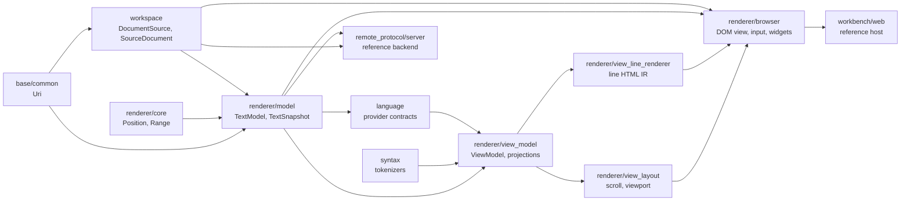

# Monaco Renderer/Model Structure

Status: implemented.
Date: 2026-06-17

## Goal

Restructure the readonly viewer's document and renderer common-layer packages so
future Monaco source comparisons have a direct local home for URI, editor core,
editor model, view model, layout, and browser rendering roles.

This is a follow-up to `monaco-role-aligned-viewer-architecture.md`. That plan
already aligned many view, layout, render-line, hover, scrollbar, folding, inlay
hint, selection, and view-zone roles. This plan narrows the remaining structural
gap around document placement and model ownership.

The viewer remains readonly. This plan does not add Monaco's editable buffer,
undo/redo stack, cursor controller, IME/edit context, command service, extension
host, minimap, overview ruler, or workbench text-file lifecycle.

## Target Shape

Monaco/VS Code splits document identity and editor state roughly like this:

```text
vscode/src/vs/base/common/uri.ts
  -> vscode/src/vs/editor/common/model/textModel.ts
  -> vscode/src/vs/editor/common/viewModel/*
  -> vscode/src/vs/editor/common/viewLayout/*
  -> vscode/src/vs/editor/browser/*

vscode/src/vs/workbench/services/textfile/*
  -> file-backed lifecycle around editor models
```

The local readonly target is:



Package names stay MoonBit-owned and snake_case. Do not create exact Monaco path
names such as `editor/common/viewModel`; use local packages such as
`base/common`, `renderer/core`, `renderer/model`, `renderer/view_model`,
`renderer/view_layout`, `renderer/view_line_renderer`, and `renderer/browser`.

## Design Rules

- Copy Monaco's role placement, not Monaco runtime code. Product code must not
  import from `vscode/` or `codemirror/`.
- Keep public DOM and embedder-facing naming MoonBit-owned even when internal
  role names are Monaco-inspired.
- Make this an aggressive internal rename. Do not keep old package paths or
  aliases just for compatibility. Migrate all callers, tests, docs, examples,
  and harness references in the same change.
- Keep common-layer packages target-neutral, DOM-free, browser-FFI-free, and
  native-FFI-free.
- Keep `workspace` as the host-neutral provider layer. It loads and watches
  source documents; it does not own the editor text model.
- Keep `renderer/browser` as the public embeddable viewer surface. External
  embedders still attach a viewer, provide a `workspace.DocumentSource`, and
  optionally register syntax and language providers.
- Preserve readonly behavior first. The package move should not change hover,
  diagnostics, semantic tokens, folding, inlay hints, selection, scrolling, or
  browser rendering behavior except where stale identity bugs are fixed.

## Reference Sources

Use these Monaco/VS Code sources as design references:

```text
vscode/src/vs/base/common/uri.ts
vscode/src/vs/editor/common/core/position.ts
vscode/src/vs/editor/common/core/range.ts
vscode/src/vs/editor/common/model.ts
vscode/src/vs/editor/common/model/textModel.ts
vscode/src/vs/editor/common/viewModel.ts
vscode/src/vs/editor/common/viewModel/*
vscode/src/vs/editor/common/viewLayout/*
vscode/src/vs/editor/browser/*
vscode/src/vs/workbench/services/textfile/common/textFileEditorModel.ts
```

Important placement decision: Monaco's `URI` is in `base/common`, `ITextModel`
and `TextModel` are in `editor/common/model`, and the file-backed workbench
model wraps an editor text model. Therefore this repo should not keep URI and
editor document identity solely inside `workspace`.

## Original State Before Implementation

- `workspace/source.mbt` owns `DocumentUri`, `SourcePath`, `SourceDocument`,
  language inference, and conversion from a loaded source document to
  `@core.DocumentSnapshot`.
- `core/document.mbt` owns `Position`, `Range`, `DocumentSnapshot`, UTF-16
  line-start caching, offset/position conversion, slicing, and clamping.
- `renderer/view_model` already owns tokenized document buckets, render-frame
  construction, folding projection, injected text, selection, and coordinate
  conversion.
- `renderer/view_layout` already owns DOM-free scroll, layout, viewport, and
  view-zone geometry.
- `renderer/view_line_renderer` already owns DOM-free line rendering data and
  HTML output.
- `renderer/browser` owns DOM creation, input, widgets, scrollbars, hover,
  rendering, and the public viewer API.
- `language`, `remote_protocol`, `server`, `workbench`, and browser services
  currently pass either `@workspace.SourceDocument` or
  `@core.DocumentSnapshot`, so the model insertion must migrate all of them.
- `scripts/check-architecture.mbtx` hard-codes several package-boundary rules,
  including `core` imports in language packages and common renderer package
  constraints. The checker must move with the package graph.

## Implementation Result

- URI identity now lives in `base/common.Uri`.
- `Position`, `Range`, and clamping helpers now live in `renderer/core`.
- The immutable buffer/model role now lives in `renderer/model` as
  `TextSnapshot` and readonly `TextModel`.
- `workspace.SourceDocument` remains the provider-loaded payload and converts
  to `TextModel`/`TextSnapshot`.
- Language providers consume `TextModel`; pure tokenization and rendering paths
  consume `TextSnapshot`.
- `renderer/browser` stores the current `TextModel` identity and drops stale
  async feature results unless URI plus version still match.

## Implementation Plan

### Phase 1: Add low-level URI package

- Create `base/common` with `Uri`.
- Move the current `workspace.DocumentUri` parsing, `memory`, `to_string`,
  `scheme`, `path`, and `display_name` behavior to `Uri`.
- Rename URI result types to match the new owner, for example
  `ParsedUri` / `UriError`, while preserving the current validation behavior.
- Update `workspace.SourcePath::file_uri`, protocol parsing, server URI
  helpers, tests, and JSON output to use `@base_common.Uri` or the actual
  package alias chosen by `moon.pkg`.

### Phase 2: Split editor core types

- Create `renderer/core`.
- Move `Position`, `Range`, UTF-16 range helpers, and `clamp_int` from the old
  root `core` package into `renderer/core`.
- Keep the local convention: offsets and columns are UTF-16 code units, lines
  are zero-based, and ranges are half-open offset ranges.
- Update `syntax`, `decorations`, `language`, `renderer/*`, protocol, server,
  and tests to import the new editor-core package.

### Phase 3: Add readonly editor model

- Create `renderer/model`.
- Move the immutable text-buffer role out of `core.DocumentSnapshot` and rename
  it to `TextSnapshot`.
- Add a readonly `TextModel` that owns:
  - `uri : @base_common.Uri`
  - `display_name : String`
  - `language_id : String`
  - `version : Int`
  - `revision : String`
  - `snapshot : TextSnapshot`
- Keep `TextSnapshot` responsible for cached line starts, `length`,
  `line_count`, line text, slice, offset-to-position, and position-to-offset.
- Make `TextModel::snapshot` or equivalent return the immutable snapshot used
  by tokenization, providers, selection, and rendering.
- Avoid mutable edit APIs. Do not add model events unless a readonly consumer
  needs a concrete behavior in this plan.

### Phase 4: Rewire workspace and language contracts

- Keep `workspace.SourceDocument` as the provider-loaded document payload and
  file/watch result type.
- Change `SourceDocument::snapshot` into a conversion that builds
  `renderer/model.TextModel` or `TextSnapshot` through the model package.
- Prefer provider-facing async traits to receive `TextModel` when they need
  URI/version identity, and `TextSnapshot` only when they are truly pure text
  computations.
- Keep `workspace.DocumentSource`, `WorkspaceTreeProvider`, and filesystem
  provider contracts in `workspace`.
- Update `language` provider result types and helpers so `Location.uri` uses
  `base/common.Uri` and text computations use `renderer/model` or
  `renderer/core` types.

### Phase 5: Rewire renderer/common and browser

- Update `renderer/view_model.TokenizedDocument` to hold
  `@renderer_model.TextSnapshot` instead of `@model.TextSnapshot`.
- Update `FrameSource`, `ViewModel`, folding, injected text, selection, and
  render-frame helpers to consume the new model/core packages.
- Update `renderer/view_layout` and `renderer/view_line_renderer` imports for
  moved range/position/snapshot types.
- Update `renderer/browser.Viewer` so its current document identity is a
  `TextModel`; the loaded `SourceDocument` remains an input from `workspace`.
- Fix async feature freshness guards to compare model identity by URI plus
  version, not version alone.
- Keep browser DOM structure, CSS classes, selectors, and embedder API stable
  unless a name directly exposes the old document/snapshot package.

### Phase 6: Rewire protocol, server, workbench, and examples

- Update `remote_protocol` JSON packet structs and parsers to use
  `base/common.Uri` and construct `workspace.SourceDocument` payloads that
  become `TextModel`s at the viewer/model boundary.
- Update `server` document caches, LSP conversion, diagnostics, semantic tokens,
  definitions, references, symbols, folding, and inlay hints to use `Uri`,
  `TextModel`, `TextSnapshot`, `Position`, and `Range` from their new owners.
- Update `workbench` provider adapters and protocol client code with the same
  identity model.
- Update `examples/embedded_viewer` and tests that construct memory documents.

### Phase 7: Remove old root core package and update guardrails

- Delete the old `core` package once all product packages have moved.
- Update every `moon.pkg` import and remove stale package references.
- Update `scripts/check-architecture.mbtx`:
  - include `base` in product dirs;
  - allow syntax/language packages to import the new editor-core/model packages
    where needed;
  - keep common renderer packages forbidden from browser, DOM, server,
    workbench, web, widgets, and Rabbita core imports;
  - keep reference-tree import checks for `vscode/` and `codemirror/`.
- Update `docs/architecture.md`, `docs/references/monaco.md`,
  `docs/references/monaco-layer-map.md`, package READMEs, and relevant
  harness docs to describe the new package graph.

## Testing And Validation

Add or update focused MoonBit tests:

- `base/common`: URI parse, memory URI, scheme, path, display name, invalid
  URI handling.
- `renderer/core`: `Position`, `Range`, range normalization, range contains,
  intersection, empty ranges, clamping behavior.
- `renderer/model`: `TextSnapshot` line starts, CRLF line-end trimming, line
  count, line text, offset/position conversion, slices, model defaults, and
  URI/version/language identity.
- `workspace`: source path normalization, file URI construction, source
  document to text model conversion, filesystem read result conversion.
- `language` and `remote_protocol`: JSON round trips, URI parsing, source
  document decoding, ranges and locations after package moves.
- `renderer/view_model`: token buckets, provider buckets, folding, wrapping,
  injected text, coordinate conversion, selection/copy.
- `renderer/browser`: current smoke/component coverage plus a regression where
  two opened documents share the same version but have different URIs; stale
  async provider results must not apply to the newly opened file.

Run these checks before considering the plan implemented:

```sh
just check
just test
just build
just test-browser
```

For a risky intermediate slice, run narrower checks first:

```sh
moon check --target all --warn-list +73
moon test --target js base/common renderer/core renderer/model workspace language remote_protocol renderer/view_model
moon test --target native base/common renderer/core renderer/model workspace language remote_protocol renderer/view_model
moon run --target native scripts/check-architecture.mbtx
```

## Exit Criteria

- No product package imports the removed root `core` package.
- `base/common.Uri` is the only URI type used for document identity.
- `renderer/model.TextModel` is the renderer/language-facing document identity
  object, and `TextSnapshot` is the immutable text buffer behind it.
- `workspace` still owns source/tree/file-provider contracts, but not editor
  model semantics.
- `renderer/browser` remains the public embeddable viewer entry point.
- The Monaco layer map names the new local homes for URI, core, model,
  view-model, layout, line-renderer, and browser roles.
- Architecture checks enforce the new package graph and still forbid product
  imports from `vscode/` and `codemirror/`.
- Full local validation passes with `just check`, `just test`, `just build`,
  and `just test-browser`.

## Non-Goals

- Do not implement a mutable Monaco `TextModel`.
- Do not add edit operations, undo/redo, cursor, selections beyond existing
  readonly selection/copy behavior, IME/edit context, or accessibility textarea.
- Do not move file watching, filesystem reads, source path normalization, or
  workspace tree traversal out of `workspace`.
- Do not preserve old internal import paths with aliases.
- Do not import, generate, or vendor Monaco/VS Code code into product packages.
