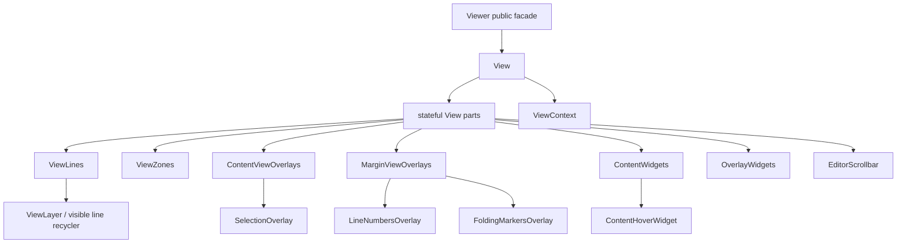

# Monaco View-Part Ownership Architecture

Status: planned.
Date: 2026-06-17

## Summary

Move the browser viewer from a Monaco-shaped dispatcher to Monaco-like ownership.
The current code already has `View`, `ViewPartRole`, `ViewContext`,
`RenderingContext`, and `RestrictedRenderingContext`. The next structural gap is
that `View` still owns most part DOM and state, while `ViewPartRole` is an enum
that dispatches all writes on every flush.

This plan supersedes the remaining unimplemented work in
`monaco-view-part-render-architecture.md`. Treat the earlier plan as the first
move from `Island` to `View`; use this plan for the next implementation pass.

## Goal

Make the browser structure comparable to Monaco's `editor/browser/view` tree:



`Viewer` remains the public readonly embedding facade. `View` owns root
construction, scheduling, and coordinated rendering. Each major visual concern
owns its DOM nodes, private state, dirty flag, read/prepare step, and DOM write.

## Non-Goals

- Do not make the viewer editable.
- Do not copy Monaco dependency injection, command services, contribution
  registration, edit context, textarea input, cursor stack, minimap, or overview
  ruler.
- Do not import product code from `vscode/` or `codemirror/`.
- Do not preserve old internal names or selectors for compatibility unless they
  are part of the public embedding surface.
- Do not promote one package per Monaco file. Promote packages only after the
  role-level structure is stable and the dependency boundary is real.

## Current State

Already aligned:

- `renderer/browser/view.mbt` defines private `View` and owns the
  `.monaco-editor.readonly-editor` root.
- `Viewer::flush_render` builds `ViewRenderInput` and delegates DOM writes to
  `View::render`.
- `renderer/browser/view_part.mbt` defines a private `ViewPart` lifecycle and
  `ViewPartRole` variants.
- `renderer/browser/rendering_context.mbt` defines `RenderingContext` and
  `RestrictedRenderingContext`.
- `docs/references/monaco-layer-map.md` already records `View`, `ViewPart`, and
  `ViewLayer` as partial Monaco roles.

Still not Monaco-like enough:

- `ViewPartRole` is a stateless enum dispatcher; it is not a set of stateful
  parts.
- `View` still stores part-owned DOM and state such as `view_lines`,
  `view_zones`, `content_widgets`, `overlay_widgets`, `line_nodes`,
  `gutter_nodes`, `render_inputs`, `hover_widget`, and `editor_scrollable`.
- `should_render` always returns `true`, so every part renders every flush.
- `ViewContext` exposes both `Viewer` and `View`, which lets parts reach around
  their intended boundary.
- `RestrictedRenderingContext` wraps the full `RenderingContext`, so it is not
  actually restricted.
- Live workbench comments still use the old "island" term.

## Monaco Reference Points

Use the checked-in VS Code submodule as the design source:

```text
vscode/src/vs/editor/browser/view.ts
vscode/src/vs/editor/browser/view/viewPart.ts
vscode/src/vs/editor/browser/view/renderingContext.ts
vscode/src/vs/editor/browser/view/viewLayer.ts
vscode/src/vs/editor/browser/viewParts/viewLines/viewLines.ts
vscode/src/vs/editor/browser/viewParts/viewLines/viewLine.ts
vscode/src/vs/editor/browser/viewParts/contentWidgets/contentWidgets.ts
vscode/src/vs/editor/browser/viewParts/overlayWidgets/overlayWidgets.ts
vscode/src/vs/editor/browser/viewParts/viewZones/viewZones.ts
vscode/src/vs/editor/browser/viewParts/viewOverlays/viewOverlays.ts
vscode/src/vs/editor/browser/viewParts/margin/margin.ts
vscode/src/vs/editor/browser/viewParts/lineNumbers/lineNumbers.ts
vscode/src/vs/editor/browser/viewParts/selections/selections.ts
vscode/src/vs/editor/browser/viewParts/editorScrollbar/editorScrollbar.ts
```

Copy the structure, not the service system:

- `View` keeps the ordered part list and coordinates rendering.
- `ViewPart` is stateful and can become dirty independently.
- `ViewLines` renders text first.
- `RenderingContext` exposes read/prepare helpers.
- `RestrictedRenderingContext` exposes only data needed during writes.
- Each part has a stable DOM node and owns its DOM writes.

## Target Ownership

After this plan, `View` should be close to:

```text
View
  root
  probe
  message
  overflow_guard
  view_context
  view_parts
  view_lines
  view_zones
  content_view_overlays
  margin_view_overlays
  content_widgets
  overlay_widgets
  editor_scrollbar
```

Fields that should move out of `View`:

```text
ViewLines
  lines_content
  view_lines
  line_nodes
  render_inputs
  rendered_window
  rendered_generation

LineNumbersOverlay
  line_numbers
  gutter_nodes
  rendered_window

FoldingMarkersOverlay
  folding

ContentViewOverlays
  view_overlays

ViewZones
  view_zones

ContentWidgets
  content_widgets
  overflowing_content_widgets
  hover_widget

OverlayWidgets
  overlay_widgets
  overflowing_overlay_widgets

EditorScrollbar
  editor_scrollable
```

If MoonBit trait objects are awkward, keep static dispatch with a private enum
that carries stateful structs:

```text
ViewPartHandle =
  ViewLinesPart(ViewLines)
  ViewZonesPart(ViewZones)
  ContentViewOverlaysPart(ContentViewOverlays)
  MarginViewOverlaysPart(MarginViewOverlays)
  ContentWidgetsPart(ContentWidgets)
  OverlayWidgetsPart(OverlayWidgets)
  EditorScrollbarPart(EditorScrollbar)
```

The key requirement is ownership, not dynamic dispatch.

## Phase 0: Baseline and Stale Terminology

- Update live docs/comments in `workbench` that still say "island"; use "View"
  or "imperative viewer view".
- Keep historical exec plans unchanged except for superseding notes.
- Add or update `docs/references/monaco-layer-map.md` rows if this plan changes
  local ownership status.
- Record current browser/component/conformance tests before moving state.

Exit criteria:

- Active docs/comments no longer describe the current viewer as an island.
- Historical plans clearly point to this follow-up for the remaining work.

## Phase 1: Stateful Part Handles

Replace the stateless `ViewPartRole` dispatcher with stateful part instances.

- Add private part structs for the current roles:
  `ViewLines`, `ViewZones`, `ContentViewOverlays`, `MarginViewOverlays`,
  `ContentWidgets`, `OverlayWidgets`, and `EditorScrollbar`.
- Give each part a small dirty-state field and methods equivalent to:
  `should_render`, `set_should_render`, `on_before_render`, `prepare_render`,
  `render`, and `on_did_render`.
- Keep the first slice behavior-preserving: parts may still borrow existing DOM
  fields from `View`, but `ViewPartRole` should stop being the central render
  switch.
- Preserve the existing render order exactly until ownership is moved.

Exit criteria:

- The render loop iterates stateful parts.
- No public `Viewer` API changes.
- Every part can become dirty independently, even if the first dirty policy is
  conservative.

## Phase 2: Move DOM Ownership Into Parts

Move DOM nodes and node caches from `View` into the matching part.

- `ViewLines` owns `.lines-content`, `.view-lines`, visible line nodes, render
  input cache, and the line recycler.
- `LineNumbersOverlay` owns line-number nodes instead of sharing the
  `ViewLines` recycler state.
- `FoldingMarkersOverlay` owns folding marker DOM under the margin overlay
  role.
- `ContentViewOverlays` owns `.view-overlays` and selection rectangles.
- `ViewZones` owns `.view-zones` mounting and zone positioning.
- `ContentWidgets` owns `.contentWidgets`, `.overflowingContentWidgets`, and
  the hover widget DOM.
- `OverlayWidgets` owns `.overlayWidgets` and `.overflowingOverlayWidgets`.
- `EditorScrollbar` owns `ScrollableElementDom` and scrollbar updates.
- `View` should append part DOM nodes but should not mutate their internals.

Exit criteria:

- `View` no longer stores line-node, gutter-node, render-input, hover-widget, or
  scrollbar internals.
- A DOM write can be traced to the part that owns that DOM node.
- Existing selectors and visible behavior remain unchanged.

## Phase 3: Real Dirty Rendering

Replace "render everything every flush" with Monaco-like dirty decisions.

Introduce a private render-change summary produced from the previous and current
`ViewRenderInput`, such as:

```text
ViewRenderChange
  frame_generation_changed
  viewport_window_changed
  scroll_position_changed
  layout_dimensions_changed
  decorations_changed
  selection_changed
  folding_changed
  view_zones_changed
  hover_changed
```

Then map changes to parts:

- `ViewLines`: frame generation, viewport window, decorations, glyph width,
  wrapping or projected-line changes.
- `LineNumbersOverlay`: viewport window, folding/hidden-area changes, gutter
  width.
- `FoldingMarkersOverlay`: folding ranges, folded state, viewport window.
- `ContentViewOverlays`: selection, viewport window, scroll position.
- `ViewZones`: zone list, viewport window, scroll position.
- `ContentWidgets`: hover state, viewport window, scroll position, zones.
- `OverlayWidgets`: overlay widget state and viewport dimensions.
- `EditorScrollbar`: dimensions, scroll position, scroll extent.

Exit criteria:

- `ViewPart::should_render` no longer always returns `true`.
- A hover-only or scrollbar-only update does not rewrite line DOM.
- Tests cover at least one negative case where line HTML is not rewritten when
  only an unrelated part changes.

## Phase 4: Restrict Contexts

Make contexts enforce the ownership model.

- Shrink `ViewContext` so it does not hand every part raw `Viewer` and `View`.
  Prefer explicit capabilities such as layout access, hover state access,
  callbacks, and shared options.
- Make `RestrictedRenderingContext` a real write-phase context. It should expose
  viewport data, scroll metrics, gutter width, transforms, line heights, and
  helper methods, but not raw `Viewer`, raw `ViewRenderInput`, or mutable
  cross-part state.
- Keep `RenderingContext` for prepare/read work, including visible-range helpers
  that depend on `ViewLines`.
- Move any read-after-write cases into named exceptions with a Monaco reference.

Exit criteria:

- Most part render methods cannot mutate another part through the context.
- Read/prepare methods and write methods have visibly different data surfaces.
- Any unavoidable cross-part call is documented with the owning part and reason.

## Phase 5: ViewLines and ViewLayer Parity

Make the line layer closer to Monaco's `ViewLines` plus `ViewLayer` split.

- Turn the current `View::render_lines` logic into `ViewLines::render_text`.
- Extract a reusable private `ViewLayer` or `VisibleLinesCollection` helper if
  it reduces duplicated line-number and line-node window management.
- Keep `ViewLine` as the per-line DOM writer.
- Move line-number rendering out of text rendering; line numbers are a margin
  overlay concern, not a `ViewLines` concern.
- Keep bounded DOM node count and limited `innerHTML` rewrites.

Exit criteria:

- Text line rendering can be explained directly against Monaco
  `viewParts/viewLines/viewLines.ts` and `view/viewLayer.ts`.
- Line number and folding changes do not require entering the text-line render
  implementation.

## Phase 6: Widget and Zone Parity

Refine higher-level parts after basic ownership is in place.

- Make hover a concrete content widget managed by `ContentWidgets`, not a
  `Viewer` helper called from a part dispatcher.
- Keep future generic content-widget shape possible, but do not expose a public
  widget API unless a real consumer needs it.
- Keep `ViewZones` responsible for zone DOM mounting and placement; `Viewer`
  may keep the public `change_view_zones` entry point, but browser DOM changes
  should flow through the part.
- Keep overlay widgets as a real empty part so future controls have a stable
  owner.

Exit criteria:

- Hover placement and zone rendering no longer require reaching through `View`
  fields from `ViewPartRole`.
- Content widgets, overlay widgets, and view zones can be tested as separate
  browser roles.

## Phase 7: Documentation and Test Migration

- Update `renderer/browser/README.md` to describe actual part ownership, not
  just role names.
- Update `docs/architecture.md`, `docs/harness.md`, and
  `docs/references/monaco.md` only if the public boundary or harness selectors
  change.
- Keep `docs/references/monaco-layer-map.md` current: rows that become closer
  to Monaco should move from `partial` only when the remaining deltas are
  documented.
- Update browser/component tests to assert ownership-sensitive behavior:
  bounded line nodes, no unnecessary line rewrites, hover as content widget,
  zones independent from lines, and scrollbar-only updates.

Exit criteria:

- Docs, tests, and code agree on `View` and `ViewPart` ownership.
- No active docs or comments use "island" for the current architecture.

## Phase 8: Optional Package Promotion

Only consider packages after the stateful part structure is stable.

Candidate package families:

```text
renderer/browser/view
renderer/browser/view_parts
renderer/browser/widgets
renderer/browser/scrollbar
```

Promotion rules:

- Promote only if the package boundary reduces imports or prevents browser
  effects from leaking.
- Keep tiny data roles as files inside a package.
- Update `scripts/check-architecture.mbtx` when new package boundaries are
  introduced.
- Run `moon info` and review `pkg.generated.mbti` changes for any public API
  movement.

Exit criteria:

- Package imports express real dependency direction.
- No common-layer package imports browser packages or Rabbita.
- `renderer/browser` remains the public embedding package unless a deliberate
  public API plan changes that.

## Validation

Run for every coherent implementation slice:

```sh
git diff --check
moon fmt
moon check --target all --warn-list +73
just check
```

For slices that touch private browser code:

```sh
moon test --target js renderer/browser
```

For slices that touch DOM, input, scroll, hover, selection, zones, or selectors:

```sh
just test-browser-conformance
just test-browser
```

For broad ownership moves, also do a live smoke check:

```sh
just dev ROOT=/Users/baozhiyuan/Workspace/moonbit-project/simple PORT=5173
```

Verify in the browser:

- a MoonBit file opens and renders;
- scrolling keeps visible line DOM bounded;
- hover still mounts in `.contentWidgets`;
- selection overlays still follow projected and zone-aware lines;
- fold/unfold updates margin and layout;
- view zones displace lines, hovers, selection, and scroll height;
- scrollbar-only updates do not rewrite line HTML;
- console is clean.

Use another port if `5173` is already occupied.

## Acceptance Criteria

- `ViewPartRole` no longer acts as the central stateless DOM dispatcher.
- Each major browser concern is a stateful private part with owned DOM, owned
  state, dirty decision, prepare step, and write step.
- `View` coordinates rendering but no longer owns part internals.
- `RestrictedRenderingContext` no longer exposes the full render input or raw
  viewer/view handles.
- The render loop mirrors Monaco's shape: prepare text viewport, render
  `ViewLines`, recollect dirty parts, prepare parts, render parts, mark rendered.
- Public embedding behavior remains readonly and still flows through `Viewer`,
  `DocumentSource`, `ViewerServices`, and `ViewerOptions`.
- Active docs/tests use the same `View` and `ViewPart` terminology as the code.
- No product code imports from `vscode/` or `codemirror/`.
